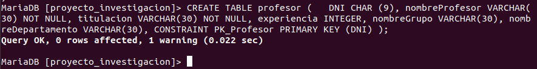

# Tarefa 3

# Creación da Base de datos
## Proyecto investigación

## Show Proyecto investigación

## Naves Espaciales & Show

PD: en algunas capturas da creacion das taboas non creei algun atributo, pero estan creados posterirormente para o correcto funcionamento da base de datos.
